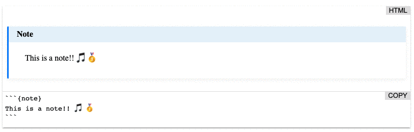

# myst-demo
[](https://www.npmjs.com/package/myst-demo)
[](https://github.com/executablebooks/myst-demo/blob/master/LICENSE)
[](https://github.com/executablebooks/myst-demo/actions)
[](https://executablebooks.github.io/myst-demo)
[](https://executablebooks.github.io/myst-demo/demo/index.html)

A web-component `<myst-demo>` that uses `markdown-it-myst` to demo the html rendering and the html output.

Add the following to something that works with HTML!

````html
<myst-demo rows="3">
```{callout} Callout
This is a callout!
```
</myst-demo>
````



# Libraries

```html
<link rel="stylesheet" href="https://unpkg.com/myst-demo/dist/myst.css">
<script async src="https://unpkg.com/myst-demo"></script>
<!-- Use the following if you require math -->
<script>
// Setup Mathjax
MathJax = {
  tex: {
    inlineMath: [['\\(', '\\)']],
    displayMath: [['\\[', '\\]']],
    processEnvironments: false,
    processRefs: false,
  },
  svg: {
    fontCache: 'global'
  }
};
</script>
<script type="text/javascript" id="MathJax-script" async src="https://cdn.jsdelivr.net/npm/mathjax@3/es5/tex-svg.js"></script>
```

## Setup

Install dependencies:

```bash
yarn install
```

## Build

To build the JavaScript version of your component:

```bash
yarn build
```

To watch files and rebuild when the files are modified, run the following command.
This will create a web-server running on localhost.

```bash
yarn start
```

## Linting

Linting of TypeScript files is provided by [ESLint](eslint.org) and [TypeScript ESLint](https://github.com/typescript-eslint/typescript-eslint).

To lint the project run:

```bash
npm run lint
```
